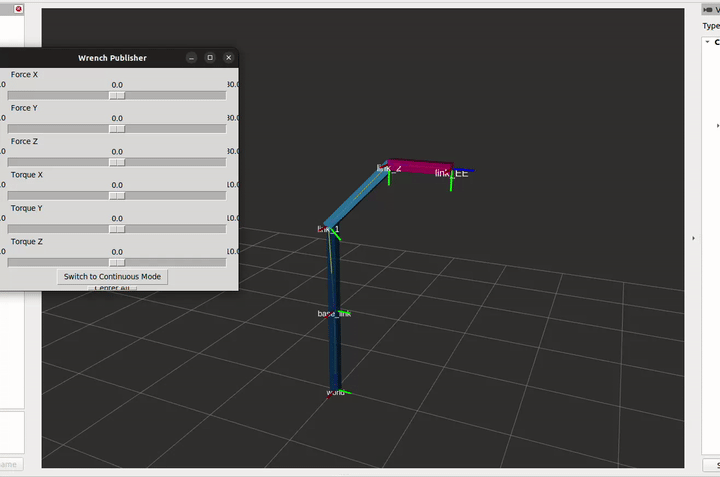
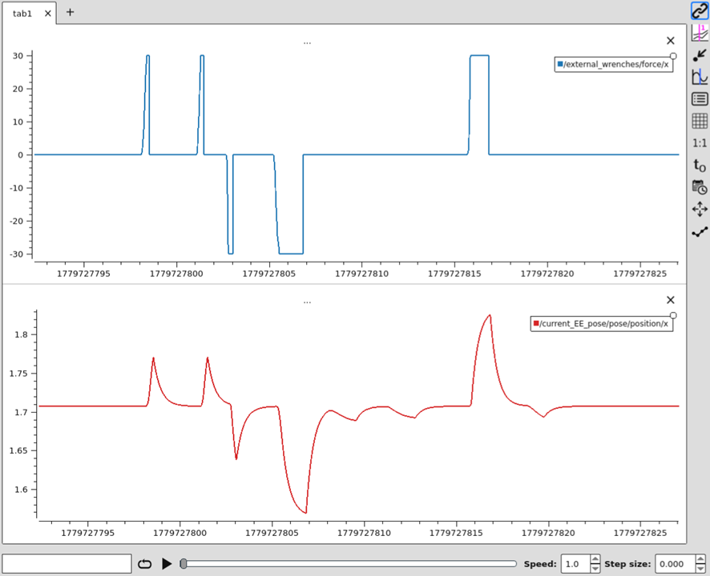
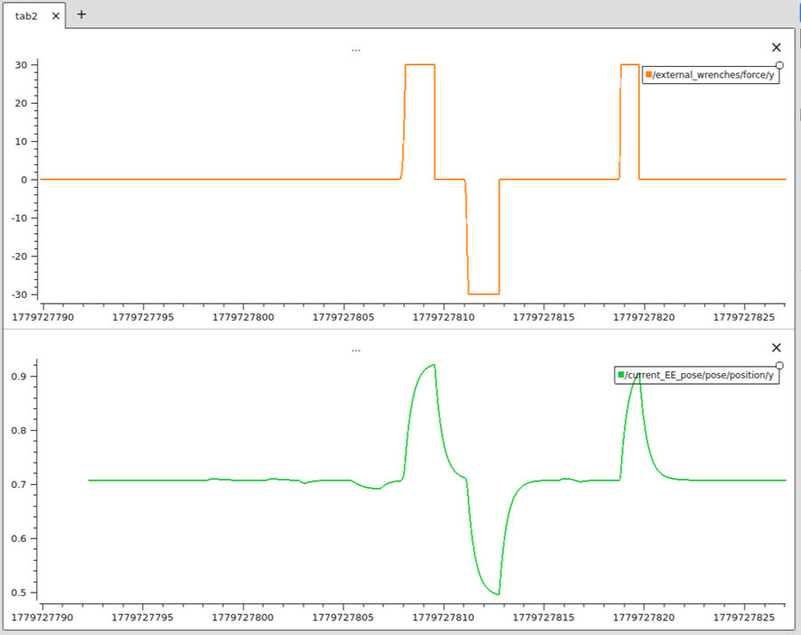

# Impedance Control
Este es el repositorio de Lab Session 4: Impedance Control.

## Ejecución 

```bash
ros2 launch uma_arm_description uma_arm_visualization.launch.py
ros2 launch impedance_control uma_arm_dynamics_launch.py
ros2 launch impedance_control gravity_compensation_launch.py
ros2 launch impedance_control dynamics_cancellation_launch.py
ros2 launch impedance_control pd_controller_launch.py
ros2 launch impedance_control impedance_controller_launch.py
```


## Explicación Detallada de los Cambios en el Controlador de Impedancia

A continuación se detallan las cinco funciones modificadas en el archivo `impedance_controller.cpp`, relacionando la formulación matemática con su implementación en C++.

---

### 1. Cinemática Directa (`forward_kinematics`)

**Objetivo:** Calcular la posición cartesiana actual del efector final, $\mathbf{x}$, a partir de las posiciones articulares actuales, $\mathbf{q}$.

**Formulación Matemática:**
La cinemática directa para un manipulador planar 2R se define como:

$$ \mathbf{x} = \begin{bmatrix} x \\ y \end{bmatrix} = \begin{bmatrix} l_1 \cos(q_1) + l_2 \cos(q_1 + q_2) \\ l_1 \sin(q_1) + l_2 \sin(q_1 + q_2) \end{bmatrix} $$

**Implementación en C++:**
Se extraen las variables articulares $q_1$ y $q_2$ del vector `joint_positions_` y se aplican las ecuaciones trigonométricas utilizando las longitudes de los eslabones $l_1$ (`l1_`) y $l_2$ (`l2_`).

```cpp
    Eigen::VectorXd forward_kinematics()
    {
        Eigen::VectorXd x(2);
        double q1 = joint_positions_(0);
        double q2 = joint_positions_(1);

        x(0) = l1_ * cos(q1) + l2_ * cos(q1 + q2);
        x(1) = l1_ * sin(q1) + l2_ * sin(q1 + q2);

        return x;
    }
```

---

### 2. Jacobiano y su Derivada (`update_jacobians`)

**Objetivo:** Calcular la matriz Jacobiana analítica, $\mathbf{J}(\mathbf{q})$, y su derivada temporal, $\dot{\mathbf{J}}(\mathbf{q}, \dot{\mathbf{q}})$, necesarias para las transformaciones de velocidad y aceleración entre el espacio articular y el cartesiano.

**Formulación Matemática:**
El Jacobiano se obtiene derivando la cinemática directa respecto a $\mathbf{q}$:

$$ \mathbf{J}(\mathbf{q}) = \begin{bmatrix} -l_1\sin(q_1) - l_2\sin(q_1+q_2) & -l_2\sin(q_1+q_2) \\ l_1\cos(q_1) + l_2\cos(q_1+q_2) & l_2\cos(q_1+q_2) \end{bmatrix} $$

La derivada del Jacobiano respecto al tiempo requiere aplicar rigurosamente la regla de la cadena (corrigiendo la errata del documento original, ya que derivar $\sin(q_1+q_2)$ introduce el factor $(\dot{q}_1 + \dot{q}_2)$):

$$ \dot{\mathbf{J}}(\mathbf{q}, \dot{\mathbf{q}}) = \begin{bmatrix} -l_1\cos(q_1)\dot{q}_1 - l_2\cos(q_1+q_2)(\dot{q}_1+\dot{q}_2) & -l_2\cos(q_1+q_2)(\dot{q}_1+\dot{q}_2) \\ -l_1\sin(q_1)\dot{q}_1 - l_2\sin(q_1+q_2)(\dot{q}_1+\dot{q}_2) & -l_2\sin(q_1+q_2)(\dot{q}_1+\dot{q}_2) \end{bmatrix} $$

**Implementación en C++:**
Se precalculan los términos trigonométricos para optimizar el coste computacional y se asignan a las matrices correspondientes de Eigen.

```cpp
    void update_jacobians()
    {
        double q1 = joint_positions_(0);
        double q2 = joint_positions_(1);
        double dq1 = joint_velocities_(0);
        double dq2 = joint_velocities_(1);

        double s1 = sin(q1);
        double c1 = cos(q1);
        double s12 = sin(q1 + q2);
        double c12 = cos(q1 + q2);

        // Calculate J(q)
        jacobian_ << -l1_ * s1 - l2_ * s12, -l2_ * s12,
                      l1_ * c1 + l2_ * c12,  l2_ * c12;

        // Calculate J'(q,q') 
        jacobian_derivative_ << -l1_ * c1 * dq1 - l2_ * c12 * (dq1 + dq2), -l2_ * c12 * (dq1 + dq2),
                                -l1_ * s1 * dq1 - l2_ * s12 * (dq1 + dq2), -l2_ * s12 * (dq1 + dq2);

        RCLCPP_INFO(this->get_logger(), "Jacobian:\n[%.3f, %.3f]\n[%.3f, %.3f]",
                    jacobian_(0, 0), jacobian_(0, 1),
                    jacobian_(1, 0), jacobian_(1, 1));

        double det = jacobian_.determinant();
        RCLCPP_INFO(this->get_logger(), "Jacobian determinant: %.6f", det);
    }
```

---

### 3. Cinemática Diferencial de Primer Orden (`differential_kinematics`)

**Objetivo:** Calcular la velocidad cartesiana actual del efector final, $\dot{\mathbf{x}}$.

**Formulación Matemática:**
La relación entre las velocidades articulares, $\dot{\mathbf{q}}$, y las velocidades cartesianas se define mediante el Jacobiano:

$$ \dot{\mathbf{x}} = \mathbf{J}(\mathbf{q})\dot{\mathbf{q}} $$

**Implementación en C++:**
Consiste en una multiplicación matricial directa utilizando las variables previamente calculadas/actualizadas.

```cpp
    Eigen::MatrixXd differential_kinematics()
    {
        Eigen::VectorXd x_dot = jacobian_ * joint_velocities_;
        return x_dot;
    }
```

---

### 4. Controlador de Impedancia (`impedance_controller`)

**Objetivo:** Determinar la aceleración cartesiana deseada, $\ddot{\mathbf{x}}_d$, que el efector final debe seguir para emular el comportamiento masa-muelle-amortiguador frente a fuerzas externas.

**Formulación Matemática:**
Se definen los errores de posición y velocidad respecto al punto de equilibrio:

$$ \tilde{\mathbf{x}} = \mathbf{x} - \mathbf{x}_d $$

$$ \dot{\tilde{\mathbf{x}}} = \dot{\mathbf{x}} - \dot{\mathbf{x}}_d $$

La ecuación de la impedancia de segundo orden establece la relación de fuerzas:

$$ \mathbf{M}\ddot{\mathbf{x}}_d + \mathbf{B}\dot{\tilde{\mathbf{x}}} + \mathbf{K}\tilde{\mathbf{x}} = \mathbf{f}_{ext} $$

Despejando la aceleración deseada $\ddot{\mathbf{x}}_d$:

$$ \ddot{\mathbf{x}}_d = \mathbf{M}^{-1}(\mathbf{f}_{ext} - \mathbf{B}\dot{\tilde{\mathbf{x}}} - \mathbf{K}\tilde{\mathbf{x}}) $$

**Implementación en C++:**
Se asume una velocidad de equilibrio nula ($\dot{\mathbf{x}}_d = \mathbf{0}$). Se calculan los errores y se despeja la aceleración invirtiendo la matriz de masa cartesianas (`mass_matrix_.inverse()`).

```cpp
    Eigen::VectorXd impedance_controller()
    {
        Eigen::VectorXd x_dot_d = Eigen::VectorXd::Zero(2); 

        Eigen::VectorXd x_error = cartesian_pose_ - equilibrium_pose_;
        Eigen::VectorXd x_dot_error = cartesian_velocities_ - x_dot_d;

        Eigen::VectorXd x_ddot = mass_matrix_.inverse() * (external_wrenches_ - stiffness_matrix_ * x_error - damping_matrix_ * x_dot_error);

        return x_ddot;
    }
```

---

### 5. Aceleraciones Articulares Deseadas (`calculate_desired_joint_accelerations`)

**Objetivo:** Convertir la aceleración cartesiana de control, $\ddot{\mathbf{x}}_d$, de vuelta al espacio articular para obtener $\ddot{\mathbf{q}}$, que es lo que el sistema dinámico de nivel inferior requiere para cancelar las dinámicas y aplicar los torques.

**Formulación Matemática:**
La cinemática diferencial de segundo orden se define como:

$$ \ddot{\mathbf{x}} = \mathbf{J}(\mathbf{q})\ddot{\mathbf{q}} + \dot{\mathbf{J}}(\mathbf{q}, \dot{\mathbf{q}})\dot{\mathbf{q}} $$

Despejando el vector de aceleraciones articulares, $\ddot{\mathbf{q}}$:

$$ \ddot{\mathbf{q}} = \mathbf{J}(\mathbf{q})^{-1}[\ddot{\mathbf{x}} - \dot{\mathbf{J}}(\mathbf{q}, \dot{\mathbf{q}})\dot{\mathbf{q}}] $$

**Implementación en C++:**
Se invierte el Jacobiano (`jacobian_.inverse()`) y se evalúa la expresión con la aceleración cartesiana calculada en la función anterior.

```cpp
    Eigen::VectorXd calculate_desired_joint_accelerations()
    {
        RCLCPP_INFO(this->get_logger(), "x_ddot: [%.3f, %.3f]",
                    desired_cartesian_accelerations_(0), desired_cartesian_accelerations_(1));

        Eigen::VectorXd q_ddot = jacobian_.inverse() * (desired_cartesian_accelerations_ - jacobian_derivative_ * joint_velocities_);

        return q_ddot;
    }
```


## Experimento 1: Aplicación de fuerzas virtuales al robot

En este primer experimento analizamos el comportamiento del manipulador bajo el esquema de control de impedancia cartesiana. A continuación se detallan las respuestas y justificaciones analíticas a las cuestiones planteadas.

---

### 1. Efectos de cambiar los parámetros de impedancia ($\mathbf{M}$, $\mathbf{B}$, $\mathbf{K}$)

El comportamiento del extremo del robot viene dictado por el modelo de impedancia de segundo orden que hemos programado en el lazo externo:

$$\mathbf{M}\ddot{\mathbf{x}}_d + \mathbf{B}\dot{\tilde{\mathbf{x}}} + \mathbf{K}\tilde{\mathbf{x}} = \mathbf{f}_{ext}$$

Modificar los parámetros en el archivo `impedance_params.yaml` altera directamente la dinámica virtual con la que el robot responde a la fuerza externa $\mathbf{f}_{ext}$:

* **Matriz de Masa ($\mathbf{M}$):** Representa la inercia virtual del sistema en el espacio cartesiano. Un valor alto hace que el efector final oponga gran resistencia a ser acelerado o decelerado. El robot responderá de manera más "pesada" y lenta ante variaciones bruscas de fuerza.
* **Matriz de Amortiguamiento ($\mathbf{B}$):** Modula la disipación de energía, actuando como una fricción viscosa. Un valor alto frena el movimiento y evita oscilaciones (respuesta sobreamortiguada). Un valor bajo permite que el robot reaccione más rápido, pero con un alto riesgo de oscilar alrededor de la pose de equilibrio (respuesta subamortiguada).
* **Matriz de Rigidez ($\mathbf{K}$):** Actúa como la constante elástica de un muelle virtual que tira del robot hacia $\mathbf{x}_d$. Un valor alto implica que se requiere una gran fuerza para desplazar al robot de su punto de equilibrio, haciéndolo muy rígido. Un valor bajo hace que el robot sea dócil o compliante.


### 2. Efecto de "alta impedancia" en el eje X y "baja impedancia" en el eje Y

Configurar una alta impedancia en un eje y baja en otro implica establecer matrices (especialmente la de rigidez $\mathbf{K}$) con valores muy dispares en su diagonal principal. Por ejemplo:

$$\mathbf{K} = \begin{bmatrix} K_{alto} & 0 \\ 0 & K_{bajo} \end{bmatrix}$$

* **Eje X (Alta impedancia):** El robot se resistirá fuertemente a cualquier desplazamiento en la dirección X. Se comportará como una superficie dura.
* **Eje Y (Baja impedancia):** El robot cederá fácilmente ante cualquier fuerza aplicada en la dirección Y. Se comportará de forma dócil y se dejará arrastrar con facilidad.


### 3. Acoplamiento de ejes ante la aplicación de fuerzas

**Observación:** Sí, las fuerzas aplicadas a lo largo del eje X generan movimientos en el eje Y, y viceversa. 

**Justificación analítica:**
Aunque nuestro controlador virtual cartesiano asume ejes desacoplados (las matrices $\mathbf{M}$, $\mathbf{B}$ y $\mathbf{K}$ son diagonales), el robot físico obedece a su propia dinámica no lineal articular:

$$\mathbf{M}_{rob}(\mathbf{q})\ddot{\mathbf{q}} + \mathbf{n}(\mathbf{q}, \dot{\mathbf{q}}) = \boldsymbol{\tau} + \mathbf{J}(\mathbf{q})^T \mathbf{f}_{ext}$$

Si el lazo interno de cancelación de dinámicas asume que no existen fuerzas externas del entorno, aplicará el siguiente par de control:

$$\boldsymbol{\tau} = \mathbf{M}_{rob}(\mathbf{q})\ddot{\mathbf{q}}_d + \mathbf{n}(\mathbf{q}, \dot{\mathbf{q}})$$

Sustituyendo el par aplicado en la ecuación dinámica del sistema real, la aceleración articular física resulta ser:

$$\mathbf{M}_{rob}(\mathbf{q})\ddot{\mathbf{q}} = \mathbf{M}_{rob}(\mathbf{q})\ddot{\mathbf{q}}_d + \mathbf{J}(\mathbf{q})^T \mathbf{f}_{ext}$$

$$\ddot{\mathbf{q}} = \ddot{\mathbf{q}}_d + \mathbf{M}_{rob}(\mathbf{q})^{-1}\mathbf{J}(\mathbf{q})^T \mathbf{f}_{ext}$$

Proyectando esta relación al espacio operacional, la matriz de inercia cartesiana aparente del manipulador es:

$\mathbf{\Lambda}(\mathbf{q}) = (\mathbf{J}(\mathbf{q})\mathbf{M}_{rob}(\mathbf{q})^{-1}\mathbf{J}(\mathbf{q})^T)^{-1}$

Debido a la cinemática del robot, esta matriz

$\mathbf{\Lambda}(\mathbf{q})$ **no es diagonal**

Por tanto, una perturbación

$\mathbf{f}_{ext}$ 

puramente en X se acopla a través de la inercia real del mecanismo, produciendo aceleraciones físicas que desplazan también el eje Y antes de que el lazo de control pueda compensarlo por completo.

RESULTADOS DE SIMULACIÓN:





---


### 4. Mitigación del fenómeno (Reto Opcional)

Para eliminar este acoplamiento indeseado y conseguir que el manipulador se comporte exactamente como dicta nuestro modelo de impedancia ideal, es necesario compensar la fuerza externa a nivel de par articular (en el nodo `dynamics_cancellation`).

Si disponemos de la medida de la fuerza externa $\mathbf{f}_{ext}$, podemos introducir un término de prealimentación (*feedforward*) en la ley de control por par calculado para contrarrestar el efecto de dicha fuerza sobre la estructura mecánica:

$$\boldsymbol{\tau} = \mathbf{M}_{rob}(\mathbf{q})\ddot{\mathbf{q}}_d + \mathbf{n}(\mathbf{q}, \dot{\mathbf{q}}) - \mathbf{J}(\mathbf{q})^T \mathbf{f}_{ext}$$

Al aplicar esta nueva ley de control, el término 
$-\mathbf{J}(\mathbf{q})^T \mathbf{f}_{ext}$ del controlador anula exactamente la perturbación física $+\mathbf{J}(\mathbf{q})^T \mathbf{f}_{ext}$ sufrida por el robot. Como resultado directo, $\ddot{\mathbf{q}} = \ddot{\mathbf{q}}_d$, garantizando que el robot físico siga de manera perfecta las trayectorias cartesianas desacopladas que emanan del controlador de impedancia, sin importar la dirección de la fuerza aplicada.


## Experimento 2: Cambio de la pose de equilibrio

En este segundo experimento, en lugar de aplicar fuerzas externas, alteramos de forma dinámica el punto de destino cartesiano del robot (la pose de equilibrio $\mathbf{x}_d$) utilizando un publicador basado en una interfaz gráfica. A continuación se analiza el comportamiento dinámico del manipulador ante estas variaciones.

---

### 1. Fundamento Matemático del Movimiento

El comportamiento del efector final sigue regido por la ecuación de impedancia que hemos programado:

$$\mathbf{M}\ddot{\mathbf{x}} + \mathbf{B}\dot{\tilde{\mathbf{x}}} + \mathbf{K}\tilde{\mathbf{x}} = \mathbf{f}_{ext}$$

En este experimento, asumimos que no interactuamos físicamente con el robot, por lo que la fuerza externa es nula ($\mathbf{f}_{ext} = \mathbf{0}$). Además, el punto de destino se envía como una referencia estática escalonada (una vez movemos el *slider*, la velocidad deseada es cero, $\dot{\mathbf{x}}_d = \mathbf{0}$). La ecuación se simplifica a la de un sistema autónomo de segundo orden:

$$\mathbf{M}\ddot{\mathbf{x}} + \mathbf{B}\dot{\mathbf{x}} + \mathbf{K}(\mathbf{x} - \mathbf{x}_d) = \mathbf{0}$$

Despejando la aceleración que el controlador comanda al robot:

$$\ddot{\mathbf{x}} = \mathbf{M}^{-1} \left[ -\mathbf{K}(\mathbf{x} - \mathbf{x}_d) - \mathbf{B}\dot{\mathbf{x}} \right]$$

#### ¿Por qué se mueve el robot?
Cuando modificamos la pose de equilibrio $\mathbf{x}_d$ a través de la interfaz gráfica, se genera instantáneamente un error de posición cartesiano:

$$\tilde{\mathbf{x}} = \mathbf{x} - \mathbf{x}_d \neq \mathbf{0}$$

Este error "estira" el muelle virtual definido por la matriz $\mathbf{K}$. El término $-\mathbf{K}(\mathbf{x} - \mathbf{x}_d)$ actúa como una fuerza de atracción interna que obliga al efector final a acelerar hacia las nuevas coordenadas proporcionadas por la interfaz, intentando hacer que el error $\tilde{\mathbf{x}}$ vuelva a ser cero.


### 2. Transitorio y Respuesta Dinámica

La forma exacta en la que el robot viaja desde su posición actual $\mathbf{x}$ hasta la nueva posición $\mathbf{x}_d$ (el régimen transitorio) no es instantánea ni lineal, sino que depende estrictamente de cómo hayamos sintonizado los parámetros del archivo `impedance_params.yaml`:

* **Matriz de Rigidez ($\mathbf{K}$):** Determina la fuerza de atracción hacia el nuevo destino. Valores más altos de $\mathbf{K}$ provocarán una aceleración inicial mucho más brusca, haciendo que el robot intente llegar rápido a la marca.
* **Matriz de Masa ($\mathbf{M}$):** Aporta inercia al movimiento. Una masa virtual elevada suavizará la aceleración inicial (el robot tardará en arrancar) y dificultará la frenada al acercarse al objetivo.
* **Matriz de Amortiguamiento ($\mathbf{B}$):** Define cómo se disipa la energía cinética durante el trayecto, definiendo el factor de amortiguamiento del sistema ($\zeta$):
  * **Sistema Subamortiguado (Bajo $\mathbf{B}$):** El robot llegará rápidamente a $\mathbf{x}_d$, pero debido a la inercia, se pasará de largo (*overshoot*) y oscilará varias veces alrededor del punto de equilibrio antes de detenerse.
  * **Sistema Sobreamortiguado (Alto $\mathbf{B}$):** El efecto viscoso dominará. El robot se acercará a $\mathbf{x}_d$ de manera lenta, asintótica y sin ninguna oscilación.
  * **Sistema Críticamente Amortiguado:** Es el balance ideal. El robot alcanza la nueva pose en el menor tiempo posible sin llegar a oscilar.


RESULTADOS DE SIMULACIÓN:


---


### 3. Conclusión del Experimento

El experimento demuestra que el control de impedancia no solo sirve para regular la interacción física con fuerzas externas (Experimento 1), sino que también actúa como un generador de trayectorias implícito. El robot actúa como si estuviera atado por gomas elásticas al punto   $\mathbf{x}_d$  ; al mover dicho punto, arrastramos al robot con una dinámica que nosotros mismos hemos esculpido mediante las matrices  $\mathbf{M}$  ,  $\mathbf{B}$ y $\mathbf{K}$  .


